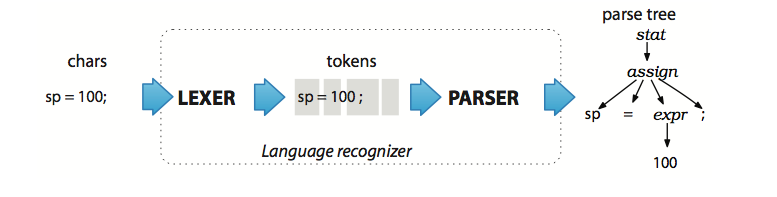

# 编译原理MiniJava前端报告

梁永清 13307130254

## 目录
1. 项目要求及完成情况
2. ANTLR介绍
3. 开发环境
4. g4语法改动说明
5. 错误检测
6. 错误检测实验
7. 项目体会与感想

## 一、项目要求及完成情况
1. git log与 `README.md` √
2. 项目报告 √
3. 正确的词法/语法分析，给出对应的文法文件 √
4. 输出正确的抽象语法树 √
5. 错误处理功能 √
	- 提示错误类型（词法错误、语法错误、语义错误等)、出错位置等 √
		- 词法错误 √
		- 语法错误 √
		- 语义错误 √
	- 错误修复 √

工程结构

	/13307130254.7z
		| src
		| test_codes
		| results
		| report.pdf
		| README.md

## ANTLR介绍
>ANTLR（全名：ANother Tool for Language Recognition）是基于 LL(*) 算法实现的语法解析器生成器（parser generator），用Java语言编写，使用自上而下（top-down）的递归下降LL剖析器方法。由旧金山大学的 Terence Parr 博士等人于1989年开始发展。

ANTLR是一款成熟的语言识别工具（Another Tool for Language Recognition），使用上下文无关文法描述语言，通过解析用户自定义的文法结构，自动生成词法分析器（Lexer）、语法分析器（Parser）和树分析器（Tree Parser）

流程如图所示，把源文件转换成 AST，需要 grammer 定义文件 MiniJava.g4，然后用生成的 Lexer 把源文件读入，分成 token 序列，然后 Parser 读入 Lexer 产生的 tokens 生成 AST。在 ANTLR 提供了 Lisenter 和 Visitor 两种方式来遍历抽象语法树，本项目基于 Listener 接口来实现对源文件的检查

## 三、开发环境
- Windows 8.1
- Eclipse & jdk 1.8.0_45
- [ANTLR](www.antlr.org) Version 4.6 

## 四、g4语法改动说明
1. 对每个变量（类、函数）的声明添加 Label，作用是在语义分析中可以很方便的访问名字和类型，如:

	MiniJava.g4
		
		varDeclaration : type=typeDeclaration name=Identifier ';';
	MiniJavaWalkerDefine.java

		public void enterVarDeclaration(MiniJavaParser.VarDeclarationContext ctx) {
			String variableType = ctx.type.getText();
			String variableName = ctx.name.getText();
			...
		}
		
2. 添加规则parameterList，便于分析参数是否有重复定义

	MiniJava.g4

		parameterList	:	type=typeDeclaration name=Identifier
						|	type=typeDeclaration name=Identifier ',' parameterList
						;
	
3. 添加空白字符跳过规则

	MiniJava.g4
	
		WS	:	[ \r\t\n]+ -> skip ;

4. 添加代码注释规则

	MiniJava.g4

		COMMENT_BLOCK	:	'/*' .*? '*/' -> skip;
		COMMENT_LINE	:	'//' .*? '\r'? '\n' -> skip;

## 五、错误检测

### 检测方法

继承 MiniJavaBaseListener 类，重载进入和离开每一个节点的函数，遍历一次语法树，记录有哪些变量声明及类的继承关系，然后进行适当操作分析错误。

### 重复定义检查
定义三个对象，分别对应整个程序、类和方法，每个对象用 TreeMap 记录该对象所拥有的成员，以方法类为例

MethodDefine.java

	import java.util.TreeMap;

	public class MethodDefine {
	
		public String methodName;
		public TreeMap<String, String> variables;
		public TreeMap<String, String> parameters;
	
		public MethodDefine() {
			methodName = "";
			variables = new TreeMap<String, String>();
			parameters = new TreeMap<String, String>();
		}
	
		public void addVariable(String type, String name) {
			variables.put(name, type);
		}
		
		public boolean containVariable(String name) {
			return variables.containsKey(name);
		}
		
		public void addParameter(String type, String name) {
			parameters.put(name, type);
		}
		
		public boolean containParameter(String name) {
			return parameters.containsKey(name);
		}
	}

然后对每个方法，检查是否有重复的参数和变量

MiniJavaWalkerDefine.java 

进入方法类时创建对象

	@Override
	public void enterMethodDeclaration(MiniJavaParser.MethodDeclarationContext ctx) {
		currentMethod = new MethodDefine();
		currentMethod.methodName = ctx.name.getText();
		if (currentClass.containMethod(currentMethod.methodName)) {
			String errorMessage = "Method " + currentMethod.methodName + " has existed!";
			MiniJavaCheck.printError(ctx.name, errorMessage);
		} else {
			currentClass.addMethod(currentMethod);
		}
		location = "Method";
	}

参数查重

	@Override
	public void enterParameterList(MiniJavaParser.ParameterListContext ctx) {
		String parameterName = ctx.name.getText();
		String parameterType = ctx.type.getText();
		if (currentMethod.containParameter(parameterName)) {
			String errorMessage = "Parameter " + parameterName + " has existed!";
			MiniJavaCheck.printError(ctx.name, errorMessage);
		} else {
			currentMethod.addParameter(parameterType, parameterName);
		}
	}

变量查重
	
	@Override
	public void enterVarDeclaration(MiniJavaParser.VarDeclarationContext ctx) {
		String variableType = ctx.type.getText();
		String variableName = ctx.name.getText();
		if (location == "Class") { // Class
			if (currentClass.containVariable(variableName)) {
				String errorMessage = "Variable " + variableName + " has existed!";
				MiniJavaCheck.printError(ctx.name, errorMessage);
			} else {
				currentClass.addVariable(variableType, variableName);
			}
		} else { // Method
			if (currentMethod.containVariable(variableName)) {
				String errorMessage = "Variable " + variableName + " has existed!";
				MiniJavaCheck.printError(ctx.name, errorMessage);
			} else {
				currentMethod.addVariable(variableType, variableName);
			}
		}
	}

### 类继承环路检查
因为类的继承不允许存在环路，所以在 Listener 退出 Goal 的时候，进行类的环路检测

MiniJavaWalkerDefine.java
	
	@Override
	public void exitGoal(MiniJavaParser.GoalContext ctx) {
		ClassExtendLoop.check(goal);
	}

检测的算法是，对每个继承链，依次遍历是否存在环，并对已检查过的类打上标记，不做重复检查

## 六、错误检测实验

1. 代码书写错误，如括号不匹配，由 ANTLR 返回语法错误信息

	BracketsUnmatched.java

		class BracketsUnmatched {
		    public static void main(String[] args) {
		    	System.out.println(new ClassC());
		    }
		} // main
		
		class classA {
			int [a; // [] unmatched!
		
			public int sum() {
				return 1;
			// {} unmatched!
		}

	错误检测结果

	

2. 重复定义检测

	MultipleDefinition.java

		class MultipleDefinition {
		    public static void main(String[] args) {
		    	System.out.println(new ClassC());
		    }
		} // main
		
		class classA {
			int apple;
			boolean apple; // multiple definition of variables
		
			public int sum() {
				return 1;
			}
			public boolean sum() { // multiple definition of methods
				return 1;
			}
			public int check(int a, int a) { // multiple definition of parameters
				return 1;
			}
		}
		
		class classA { // multiple definition of classes
		}

	错误检测结果

	

3. 类继承环路检测

	LoopDetection.java

		class LoopDetection {
		    public static void main(String[] args) {
		    	System.out.println(new ClassC());
		    }
		} // main
		
		class ClassA extends ClassC {
		}
		
		class ClassB extends ClassA {
		}
		
		class ClassC extends ClassB {
		}

	错误检测结果

	

## 七、项目体会与感想
- 学习了 ANTLR 这种强有力的工具进行语法前端分析，节省了很多工作量
- 在学习 ANTLR 的过程中，一开始想用 Python 来完成 PJ，但后来觉得直接用 Java 更方便，所以绕了点弯路，因为对 ANTLR 不熟悉，读语法和文档耗费了较多的时间
- 这个 Project 让我们深入了解了编译前端的工作流程，以前一直觉得编译是一件非常困难的工作，经过这次学习后，觉得编译工作充满趣味性